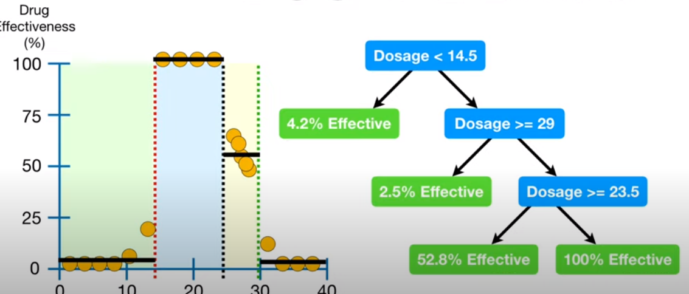

#Lesson 2 Exploratory Data Analysis
- Use AWS SageMaker Studio to access S3 datasets and perform data analysis, feature engineering with Data Wrangler and Pandas. And finally label new data using SageMaker Ground Truth.

- 
## Exploratory data analysis
- calculate the descriptive data analysis for the features ,
- know the relation between the features each other to know if there is strong relation between two features we can neglect one of them ,
- also know the relation between features and the target , max and min for each feature to detect outliers and the range of the data , data distribution from histogram , detect nulls  and deal with them ,
- data hot-encode , as a preparation for training and save the data that is ready for the training process
## AWS sagemaker
- 
### What is Amazon S3? 
- Amazon Simple Storage Service (Amazon S3) is an object storage service that offers industry-leading scalability, data availability, security, and performance. Customers of all sizes and industries can use Amazon S3 to store and protect any amount of data for a range of use cases, such as data lakes, websites, mobile applications, backup and restore, archive, enterprise applications, IoT devices, and big data analytics. Amazon S3 provides management features so that you can optimize, organize, and configure access to your data to meet your specific business, organizational, and compliance requirements.
- in short, it is the storage to load the dataset into for training usage , save train weights or any files
### EC2
- Amazon Elastic Compute Cloud (Amazon EC2) provides scalable computing capacity in the Amazon Web Services (AWS) Cloud
- this is the machine you will do the work on that is attached to your jupyter file or any services you use , you can specify amount of GPUs and CPUs you use and the amount of memory 
- there are alot of instances you can choose from [sagemaker Pricing](https://aws.amazon.com/sagemaker/pricing/)
  - 
### Sagemaker Studio
- Sagemaker Studio is a cloud-based IDE, centered around Jupyter Lab but focused specifically on Machine Learning practitioners in mind. It allows you to complete the whole lifecycle of machine learning, from creating datasets, performing EDA, to training and hosting your models. Because it’s cloud-first, you can share and collaborate easily among peers.
- [Setting up Sagemaker studio](assets/webPages/setting up Sagemaker Studio.htm)
### Data Wrangler
# Lesson 4 Model Deployment Workflow
## introduction
- talks about stages of model deployment 
- 

### Data Splitting
- This allows you to have isolation between datasets before doing data preparation and prevent any issues where data preparation on the entire dataset can alter model performance.

### Data Preparation
- Data needs to be in a format the model can use for training. Most data is dirty, so it will need to be cleaned in a variety of ways so the model can use it. During the EDA process, some data may already be in a prepared state.

### Training
- Model training works best with clean data. Data splitting and data prep feed into training

### Evaluation
- Evaluate trained models on unseen data. The outcome of evaluation leads to product decisions.

### Tuning
- Tuning changes how the model is trained. Optimizations in tuning feedback into previous steps. Workflow is code, allows repeatable iteration.

## Data cleansing and feature engineering
### clean data
- Bad data could be missing or wrong, Remove missing or invalid data, Remove entire rows or columns if data is missing ,Possibly fix bad values by replacing with average or interpolation , Scikit-learn allows the dropping of values easily with the .dropna() method
- `df.dropna()` drop nulls
### Feature engineering
- create a robust dataset to increase the effectiveness of a model , prepare it for training 
- 
- `df.info()` --> show columns and their datatype
  - 
#### change datatype
- 
#### Normalizing data

#### Parsing Datatypes
- 
- extract year and months and days from datetime col
```
df['yyyy'] = pd.to_datetime(df['StartDate']).dt.year
df['mm'] = pd.to_datetime(df['StartDate']).dt.month
```
### one-hot encoding


## Model training
- all models have the fit method which returns trained model and score method to evaluate the model by choosing the evaluation metric you want to measure with
- 
## model evaluation
### regression metrics
- measuring the distance between the predicted values and actual values (R2 the higher the r2 the better the model0 , RMSE "root mean square error")
### Classification metrics
- accuracy = (TP+TN)/total 
- True positive --> label is positive and i identified it as positive
- False negative --> label is positive and i identified it as negative
- True negative --> label is negative and i identified it as negative
- False positive --> label is negative and i identified it as positive
- we have two errors FP and FN  , if FP decreases then  TN will increase , if FN decreased TP increases
- precision = (TP/(TP+FP)) "no negative classified  as positive " 
  - identifies how good the model identifies the actual positive as positive
  - how many  (correctly identified positives ) from the predicted from the model as positive (TP(predicted as positive, and they are positive ) +FP (predicted as positives, but they aren't positives ))
- Recall = (TP/(TP+FN ))  "no positive classified as negative"
  - how many (correctly identified positives ) from the (predicted from model as positive, and they are positive) + (predicted from model negative, and they are positive)
  - the goal to identify all positives as positives doesn't matter how many are not actually positive the goal that all positives are correctly classified as positive
## Hyperparameters tuning
- the way you change hyperparameters
- 
# Lesson 5 Algorithms and tools
## XGBOOST
- to watch Video 
  - [Xgboost Classification Indepth Maths Intuition](https://www.youtube.com/watch?v=gPciUPwWJQQ&ab_channel=KrishNaik)
  - [Xgboost Regression In-Depth Intuition Explained- Machine](https://www.youtube.com/watch?v=w-_vmVfpssg)

```python
from xgboost import XGBClassifier
# read data
from sklearn.datasets import load_iris
from sklearn.model_selection import train_test_split
data = load_iris()
X_train, X_test, y_train, y_test = train_test_split(data['data'], data['target'], test_size=.2)
# create model instance
bst = XGBClassifier(n_estimators=2, max_depth=2, learning_rate=1, objective='binary:logistic')
# fit model
bst.fit(X_train, y_train)
# make predictions
preds = bst.predict(X_test)
```
## Random forest

## AutoGluon
- AutoGluon is a new open source AutoML library that automates deep learning (DL) and machine learning (ML) for real world applications involving image, text and tabular datasets.
- autoGluon do Data preparation, feature engineering, validation splitting, missing value handling, and model selection
- With AutoGluon, you don’t have to have any familiarity with the underlying models, as all hyperparameters will be automatically tuned within default ranges that are known to perform well for the particular task and model.
### Tabular Data Example
- we don’t need to do any data processing, feature engineering, or even declare the type of prediction problem. AutoGluon automatically prepares the data and infers whether our problem is regression or classification (including whether it is binary or multiclass).
- you provide the name of the label column, and it will do the rest
- With AutoGluon, there is no need to specify validation data. AutoGluon will optimally allocate a validation set using the training data provided.
```python
from autogluon import TabularPrediction as task
train_path = 'https://autogluon.s3.amazonaws.com/datasets/AdultIncomeBinaryClassification/train_data.csv'
train_data = task.Dataset(file_path=train_path)
predictor = task.fit(train_data=train_data, label='class', output_directory='ag-example-out/')


predictor = task.load('ag-example-out/')
test_path = 'https://autogluon.s3.amazonaws.com/datasets/AdultIncomeBinaryClassification/test_data.csv'
test_data = task.Dataset(file_path=test_path)
y_test = test_data['class']
leaderboard = predictor.leaderboard(test_data)
```
- 
- another example  


For expert ML practitioners, AutoGluon allows this process to be easily customized. For example, you can specify ranges of values to consider for certain hyperparameters
## extra info
### Regression Trees
- using decision trees for predicting continuous values , assume we are predicting amount of drug concentration that affects patients
- 
- this is a linear relation but if it's not a liner relation like this
- 
- at this case using straight line won't be accurate , using regression decision tree is one solution 
- regression trees uses numeric value to divide the data on , if the division lead to a leaf node (final result) the result will be the avg of the output of the entries that fall under this split
- 
- 
#### splitting criteria
- it's an iterative method each time we use a specific value for splitting and calculate the best line that minimize the mean squared error till a certain threshold which is the error or min no of nodes to split
- 
- selecting the splitting point
  1. add the line to take pt (1,1) in a side and all others in a side =`line=avg(x=1,x=2)=1.5` , the pts where x<1.5 in a side and the pts x>=1.5 in the other side
    - the y value for each part or the horizontal line will equal the avg of the points in the side
      - side x<1.5 avg (1)=1 , side x>=1.5 avg(1,2,1.4,1.1,1,5.5,6.1,6.7,6.4)=3.6125
    - calculate the mse for all points x<1.5 `(1-y)**2` and x>=1.5 `(3.6125-y)**2`for all points and sum the error , divide by size , this is the error for this split
  2. add the line to split (1,1),(2,1.2) in a side and the others in a side which is avg between the second two points which are (x=2),(x=3) =2.5 and repeat what you did at step one  
  - after the first split by selecting the best threshold with min squared error if after the split the remaining points in either one of the sides or both are less than the threshold for splitting continue splitting
- example after splitting
  - 
  

### bias and variance in machine learning
#### Bias
- Bias is how far are the predicted values from the actual values. If the average predicted values are far off from the actual values then the bias is high.
- it implies that the model is too simple and does not capture the complexity of data thus underfitting the data.
#### Variance
- Model with high variance pays a lot of attention to training data
  -  
  - 
  - the third regression model perfectly tries to pass all training points going up and down trying not mess any point this mean that the variance of the output of the model is high (the avg distance between each output and the mean of outputs is high) because the curve is going up and down to fit the train data 
- it does not generalize on the data which it hasn't seen before. As a result, such models perform very well on training data but has high error rates on test data.
#### summary
- high variance means overfitting , high bias means underfitting 
- good model has low variance and low bias
### Ensembling methods in machine learning
#### Stacking
- Stacked Generalization, or stacking for short, is an ensemble method that seeks a diverse group of members by varying the model types fit on the training data and using a model to combine predictions.
- you can combine more than one model that use different algorithms where each model may be good for some certain features in the data combining them with a model that decides in each case to weight a certain model to take the answer from it
#### Bagging
- 
- you take samples from dataset (sample of rows  or sample of columns or both sample of rows with specific sample of columns)
- you give each sample to a model to train on it then each model will be good with its part only
- this will avoid
  - noise --> because if you have 200 noisy rows the rows will be split among all learners so each model will have little noisy rows
  - overfitting --> each model will overfit on its data on some features and rows not the whole data they aren't remembering our data because we split on different models   , if we combine a result from them all we are collecting a result for the whole picture without overfitting , the avg is a result  little away from train data results not perfectly fit train data so the variance will decrease
- algorithms
  - Bagged Decision Trees (canonical bagging)
  - Random Forest
  - Extra Trees
#### Boosting
  - 
  - Boosting is an ensemble method that seeks to change the training data to focus attention on examples that previous fit models on the training dataset have gotten wrong by add wight to the misclassified points in the error function to make sure that it is classified correctly the next model
  - The key property of boosting ensembles is the idea of correcting prediction errors. The models are fit and added to the ensemble sequentially such that the second model attempts to correct the predictions of the first model, the third corrects the second model, and so on.
  - We can summarize the key elements of boosting as follows:
    - Bias training data toward those examples that are hard to predict.
    - Iteratively add ensemble members to correct predictions of prior models.
    - Combine predictions using a weighted average of models.
#### [difference between bagging and boostin](https://www.upgrad.com/blog/bagging-vs-boosting/#:~:text=Bagging%20is%20a%20method%20of,Boosting%20decreases%20bias%2C%20not%20variance.)