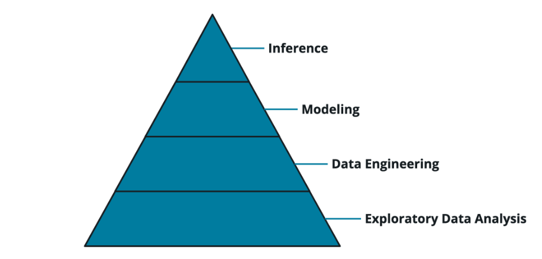

#Lesson 2 Exploratory Data Analysis
- Use AWS SageMaker Studio to access S3 datasets and perform data analysis, feature engineering with Data Wrangler and Pandas. And finally label new data using SageMaker Ground Truth.

- 
## Exploratory data analysis
- calculate the descriptive data analysis for the features ,
- know the relation between the features each other to know if there is strong relation between two features we can neglect one of them ,
- also know the relation between features and the target , max and min for each feature to detect outliers and the range of the data , data distribution from histogram , detect nulls  and deal with them ,
- data hot-encode , as a preparation for training and save the data that is ready for the training process
## AWS sagemaker
- 
### What is Amazon S3? 
- Amazon Simple Storage Service (Amazon S3) is an object storage service that offers industry-leading scalability, data availability, security, and performance. Customers of all sizes and industries can use Amazon S3 to store and protect any amount of data for a range of use cases, such as data lakes, websites, mobile applications, backup and restore, archive, enterprise applications, IoT devices, and big data analytics. Amazon S3 provides management features so that you can optimize, organize, and configure access to your data to meet your specific business, organizational, and compliance requirements.
- in short, it is the storage to load the dataset into for training usage , save train weights or any files
### EC2
- Amazon Elastic Compute Cloud (Amazon EC2) provides scalable computing capacity in the Amazon Web Services (AWS) Cloud
- this is the machine you will do the work on that is attached to your jupyter file or any services you use , you can specify amount of GPUs and CPUs you use and the amount of memory 
- there are alot of instances you can choose from [sagemaker Pricing](https://aws.amazon.com/sagemaker/pricing/)
  - 
### Sagemaker Studio
- Sagemaker Studio is a cloud-based IDE, centered around Jupyter Lab but focused specifically on Machine Learning practitioners in mind. It allows you to complete the whole lifecycle of machine learning, from creating datasets, performing EDA, to training and hosting your models. Because it’s cloud-first, you can share and collaborate easily among peers.
- [Setting up Sagemaker studio](assets/webPages/setting up Sagemaker Studio.htm)
### Data Wrangler
# Lesson 4 Model Deployment Workflow
## introduction
- talks about stages of model deployment 
- 

### Data Splitting
- This allows you to have isolation between datasets before doing data preparation and prevent any issues where data preparation on the entire dataset can alter model performance.

### Data Preparation
- Data needs to be in a format the model can use for training. Most data is dirty, so it will need to be cleaned in a variety of ways so the model can use it. During the EDA process, some data may already be in a prepared state.

### Training
- Model training works best with clean data. Data splitting and data prep feed into training

### Evaluation
- Evaluate trained models on unseen data. The outcome of evaluation leads to product decisions.

### Tuning
- Tuning changes how the model is trained. Optimizations in tuning feedback into previous steps. Workflow is code, allows repeatable iteration.

## Data cleansing and feature engineering
### clean data
- Bad data could be missing or wrong, Remove missing or invalid data, Remove entire rows or columns if data is missing ,Possibly fix bad values by replacing with average or interpolation , Scikit-learn allows the dropping of values easily with the .dropna() method
- `df.dropna()` drop nulls
### Feature engineering
- create a robust dataset to increase the effectiveness of a model , prepare it for training 
- 
- `df.info()` --> show columns and their datatype
  - 
#### change datatype
- 
#### Normalizing data

#### Parsing Datatypes
- 
- extract year and months and days from datetime col
- ` df['yyyy'] = pd.to_datetime(df['StartDate']).dt.year
df['mm'] = pd.to_datetime(df['StartDate']).dt.month`
### one-hot encoding

## Model training
- all models have the fit method which returns trained model and score method to evaluate the model by choosing the evaluation metric you want to measure with
- 
## model evaluation
### regression metrics
- measuring the distance between the predicted values and actual values (R2 the higher the r2 the better the model0 , RMSE "root mean square error")
### Classification metrics
- accuracy = (TP+TN)/total 
- True positive --> label is positive and i identified it as positive
- False negative --> label is positive and i identified it as negative
- True negative --> label is negative and i identified it as negative
- False positive --> label is negative and i identified it as positive
- we have two errors FP and FN  , if FP decreases then  TN will increase , if FN decreased TP increases
- precision = (TP/(TP+FP)) "no negative classified  as positive " 
  - identifies how good the model identifies the actual positive as positive
  - how many  (correctly identified positives ) from the predicted from the model as positive (TP(predicted as positive, and they are positive ) +FP (predicted as positives, but they aren't positives ))
- Recall = (TP/(TP+FN ))  "no positive classified as negative"
  - how many (correctly identified positives ) from the (predicted from model as positive, and they are positive) + (predicted from model negative, and they are positive)
  - the goal to identify all positives as positives doesn't matter how many are not actually positive the goal that all positives are correctly classified as positive
## Hyperparameters tuning
- the way you change hyperparameters
- 

